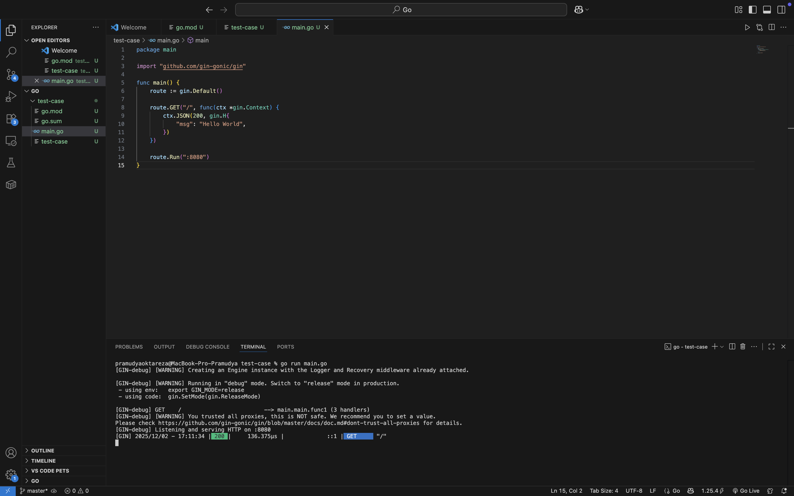

# Test-case

## Deskripsi
Repository ini berisi contoh aplikasi sederhana menggunakan **Golang** dengan framework **Gin**, yang di-deploy ke **Google Cloud Run** menggunakan **Docker** dan otomatisasi **CI/CD dengan GitHub Actions**.

---

## Membuat Program

Berikut contoh kode aplikasi:

```go
package main

import "github.com/gin-gonic/gin"

func main() {
	route := gin.Default()

	route.GET("/", func(ctx *gin.Context) {
		ctx.JSON(200, gin.H{
			"msg": "Hello World",
		})
	})
	
	route.Run(":8080")
}


```
go run main.go
```


